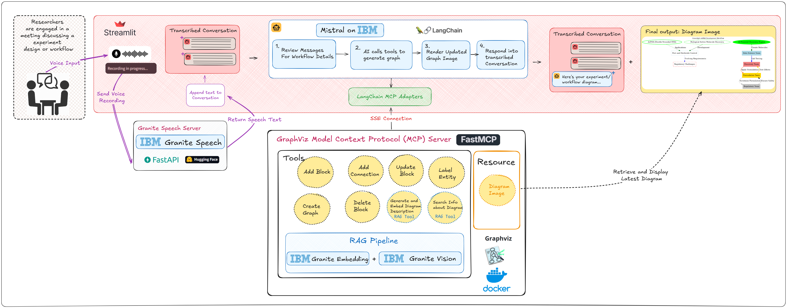
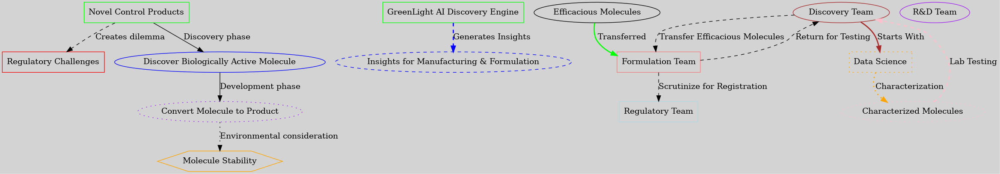

# 2025-April-IBM-Lean-AI-Solutions-Hackathon
Lean AI Solutions Hackathon, with IBM Granite Models

## Introduction
GreenLight Biosciences is revolutionizing agriculture with innovative RNA-based solutions. Using a proprietary platform, we produce cost-effective RNA at scale to protect crops and bees from pests and diseases, offering an eco-friendly alternative to chemical pesticides. Our flagship product, Calantha, is the first EPA-approved RNA-based solution for controlling Colorado Potato Beetles.

To develop these groundbreaking products, our team designs and executes experiments to evaluate effectiveness in both lab and field settings. While brainstorming and planning experimental designs, researchers often rely on visual aids to enhance clarity and foster alignment. However, creating these visuals is frequently an afterthought, leading to inefficiencies and extended meeting times.

To address this challenge, we introduce **DiagramGenie**, a GenAI application powered by IBM Granite models. DiagramGenie generates visual workflows in real time based on speech input, streamlining collaboration and making work more engaging.

## How to run?
### Start GraphVis MCP Server
```cd GraphVisMCPServer```

```python3 graphvis_mcp_server.py```

### Start DiagramGenie
```cd DiagramGenie```

```streamlit run app.py```

## DiagramGenie System Architecture



## DiagramGenie-in-Action
https://www.youtube.com/watch?v=UN8kv2V0Hbs

## Example Output
